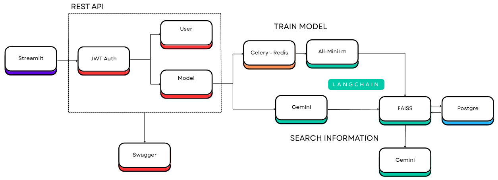

# ChatBot API with Gemini and Vector Search

[//]: <> (TODO: gif do projeto rodando)

## Summary

* [About the Project](#about-the-project)

* [Endpoints](#endpoints)

* [Tools and Libraries](#tools-and-libraries)

* [Setup](#setup)

* [File Structure](#file-structure)

## About the Project

This is a study project in *Natural Language Processing* (NLP) of *Large Language Models* (LLM) in which sentence similarity in a vector bank was used. Access to the functionalities is done through a *RESTful API* developed using *Django* and *JWT Authentication*.

The main LLM used in the project was *Google Gemini* ([**gemini-1.5-flash**](https://ai.google.dev/gemini-api/docs/models?hl=pt-br#gemini-1.5-flash)) which performs two main functions:

* **Intent Router:** the model decides whether the initial message is a greeting or whether the sentence should be looked up in the vector bank;

* **Final Answer Generator:** from the 3 most similar answers to the user's sentence, a final answer is generated by the model in order to answer the initial question.

The second LLM used in the project was [**sentence-transformers/all-MiniLM-L6-v2**](https://huggingface.co/sentence-transformers/all-MiniLM-L6-v2) from the [**Sentence Transformers**](https://huggingface.co/sentence-transformers) library on *HuggingFace*. This model is under the [**Apache License 2.0**](https://www.apache.org/licenses/LICENSE-2.0). Here the model performs the function of generating the *embeddings* (vectors) of the sentences present in the database. The vector bank used was *FAISS*, which stores the sentence vectors and the reference (*id*) of the *embeddings* in the *Postgre* bank.

The database used was [**habedi/stack-exchange-dataset**](https://huggingface.co/datasets/habedi/stack-exchange-dataset), made available by [**habedi**](https://huggingface.co/habedi) on *HuggingFace* under the [**Creative Commons**](https://creativecommons.org/licenses/) license, which has data for questions asked in a *Stack Exchange* (SE) question answering community. The data was downloaded and saved in a *Postgre* database.

 

 

## Endpoints

* **Auth:**
  * login
  * logout
  * token refresh

* **User:**
  * list users
  * create
  * read
  * update
  * delete

* **Model:**
  * train model
  * train monitor

* **Search:**
  * search information

## Tools and Libraries

For this project, the following tools were needed:

### Programming Language

* [**Python**](https://www.python.org/) - Powerful and easy-to-read programming language used for project development.

### Libs and Frameworks

#### Web Development and APIs

* [**django**](https://www.djangoproject.com/) - Python framework that facilitates rapid development of web applications with a pragmatic design.
* [**djangorestframework**](https://www.django-rest-framework.org/) - Flexible toolkit for building web APIs with Django.
* [**djangorestframework-simplejwt**](https://pypi.org/project/djangorestframework-simplejwt/) - authentication with JWT tokens.
* [**psycopg2-binary**](https://pypi.org/project/psycopg2-binary/) - connection between Python and PostgreSQL databases.
* [**Swagger**](https://swagger.io/) - Framework for testing and documenting RESTful APIs.

#### Database

* [**PostgreSQL**](https://www.postgresql.org/) - Open source object-relational database for data storage.

#### Asynchronous Task Management

* [**redis**](https://redis.io/) - In-memory data storage system, used as a message broker by *Celery*.
* [**celery**](https://docs.celeryproject.org/en/stable/) - Library for executing distributed asynchronous tasks.

#### Environment Configuration and Management

* [**python-decouple**](https://pypi.org/project/python-decouple/) - Helps separate configurations from the code, making it easier to manage parameters without having to change the code.

#### NLP and Data Processing

* [**pandas**](https://pandas.pydata.org/) - data manipulation in tables.
* [**beautifulsoup4**](https://pypi.org/project/beautifulsoup4/) - information extraction in HTML.
* [**torch**](https://pytorch.org/) - Deep learning library used for applications such as computer vision and natural language processing.
* [**Sentence Transformers**](https://www.sbert.net/) - module to access, use and train text and image embedding models.
* [**langchain**](https://www.langchain.com/) - building applications with LLM in modular architecture.
* [**langchain-community**](https://pypi.org/project/langchain-community/) - extra community connectors and integrations for LangChain.
* [**langchain-huggingface**](https://huggingface.co/blog/langchain) - Integration of HuggingFace models into LangChain.
* [**langchain-google-genai**](https://pypi.org/project/langchain-google-genai/) - Integration of Google models into LangChain.
* [**faiss-cpu**](https://pypi.org/project/faiss-cpu/) - Vector database for similarity searching in large vector databases.

#### Frontend

* [**streamlit**](https://streamlit.io/) - create interactive web interfaces in a simple way.
* [**streamlit-autorefresh**](https://discuss.streamlit.io/t/streamlit-autorefresh/14519) - automatically refresh the Streamlit interface at set intervals.

## Setup

The project setup uses **Ubuntu** as the operating system.

### PostGreSQL

1. Install:

        sudo apt install postgresql postgresql-contrib

2. Check execution status:

        sudo systemctl status postgresql

3. If it is not running, use the following command:

        sudo systemctl start postgresql

### Celery Broker - Redis

1. Install:

        sudo apt update

        sudo apt install redis-server

2. Check execution status:

        sudo systemctl status redis

3. If it is not running, use the following command:

        sudo systemctl start redis

4. To verify that Redis is running correctly, use the command:

        redis-cli ping

    the return at the Terminal must be:

        PONG

### Configure Environment Variables

Create a .env file in the root of the project and add the environment variables as shown in the [.env.example](.env.example) file. The variables required for this project are:

* `DB_NAME`: name of the database used in the project.

* `DB_USER`: name of the user that will be used to connect to the database. It must have the necessary read and write permissions.

* `DB_PASSWORD`: password of the database user to perform authentication.

* `DB_HOST`: address of the database server. If it is local, then localhost must be used.

* `DB_PORT`: port used by the database to perform the connection.

* `GOOGLE_API_KEY`: API KEY generated in [Google AI Studio](https://aistudio.google.com/prompts/new_chat).

### Virtual Environment

Creating the Python virtual environment - *venv* from the requirements.txt file. Run the following commands in the **project root**:

        python3 -m venv venv

        source ./venv/bin/activate

        pip install -r requirements.txt

[//]: <> (TODO: falta rodar o script de criar o super usuario no banco postgre e cria o super usuario no django)

### Perform Migrations

With PostgreSQL running and the correct connection settings in your `.env` file, you can run Django migrations to create the necessary tables in your database:

        python manage.py makemigrations

        python manage.py migrate

### Create Superuser

The superuser is a special type of user that has full administrative permissions. To create one, simply issue the following command:

        python manage.py createsuperuser

### Execute the Project

1. Open **three Terminal tabs** in the project's `root` directory.

2. In the first tab, run the *Django* server:

        source ./venv/bin/activate

        cd chat_bot_api/

        python manage.py runserver

    Through the link provided, it is possible to access the documentation and testing of endpoints with *Swagger*.

3. In the second tab, run *Celery*:

        source ./venv/bin/activate

        cd chat_bot_api/

        celery -A chat_bot_api worker --loglevel=debug --concurrency=4 --max-tasks-per-child=500

    asynchronous procedures will be shown here.

4. In the third tab, run *Streamlit*:

        source ./venv/bin/activate

        streamlit run ui/main.py

    automatically a page in the *Browser* will open to test the project with the graphical interface.

## File Structure

The *Django* Apps used here follow the basic pattern, with files like **admin.py**, **apps.py**, **models.py**, **tests.py**, **urls.py** and **views.py**. Files other than these in the Apps will be shown below.

* [**assets/**](assets/): folder containing files used in README.md;

* [**chat_bot_api/**](chat_bot_api/): folder containing the entire implementation of the API in Django;

  * [**app_auth**](chat_bot_api/app_auth/): folder containing the *Django* app for **login**, **logout** and **refresh token**;

  * [**app_model/**](chat_bot_api/app_model/): folder containing the app for sending *zip* files, sending data to the database, creating *embeddings*, testing questions or sentences and monitoring execution status;
    * [services.py](chat_bot_api/app_model/services.py): file containing all processing of requests made in the *endpoints* of *model*;
    * [tasks.py](chat_bot_api/app_model/tasks.py): file containing the asynchronous *task* to run on *Celery*, as well as the status update of each step.

  * [**chat_bot_api/**](chat_bot_api/chat_bot_api/): folder containing the main configurations of the project's *API*;

  * [**core/**](chat_bot_api/core/): folder containing the app that has the files necessary to run *Swagger* as well as implementations common to all other apps;

  * [**user/**](chat_bot_api/user/): folder containing the app responsible for managing the creation, reading, listing, updating and deleting of users;
    * [serializers.py](chat_bot_api/user/serializers.py): file containing the validations necessary for the functionalities present in the user *endpoints*.

  * [manage.py](chat_bot_api/manage.py): file created by *Django* containing implementations to start and monitor the execution of the *API*;

* [**data/**](data/): folder containing the project's input data sent via *endpoint*;
  * [**raw/**](data/raw/): folder that should contain the initial data of the project, received via *API endpoint*;
  
  * [**processed/**](data/processed/): folder containing the initial files processed into vectors.
    * [**faiss_index/**](data/processed/faiss_index/): folder containing the vector tree saved in memory.

* [**ui/**](ui/): folder containing the *Frontend* implementation;
  * [**pages/**](ui/pages/): folder containing the interface pages;
    * [chatbot.py](ui/pages/chatbot.py): implementation of the chat page;
    * [login.py](ui/pages/login.py): implementation of the login screen and user creation.
  
  * [main.py](ui/main.py): main page that calls the home page.

* [**venv/**](venv/): folder containing the Python virtual environment and the packages needed to run the project. Created in [create venv](#virtual-environment);

* [.env](.env): unmonitored file containing the settings for connecting to the database;

* [.env.example](.env.example): example file for environment variables needed for the project;

* [.gitignore](.gitignore): file with instructions for which files *Git* should not monitor.

* [LICENSE.md](LICENSE.md): current software license for this project;

* [requirements.txt](requirements.txt): file containing the libraries needed to create the virtual environment.
